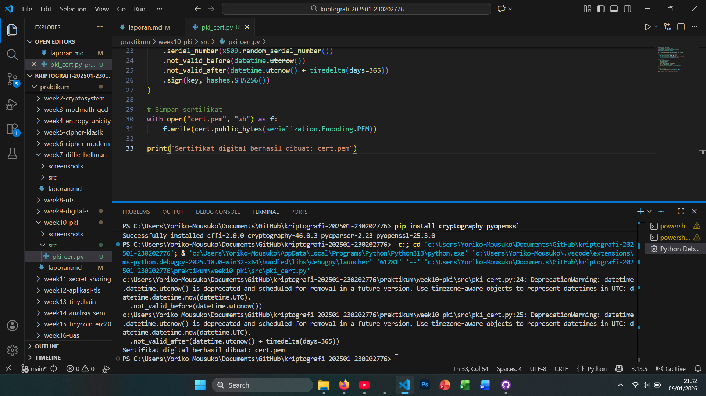

# Laporan Praktikum Kriptografi
Minggu ke-: 10  
Topik: [Public Key Infrastructure (PKI & Certificate Authority)]  
Nama: [Ramzi Selpora Widiyanto]  
NIM: [230202776 ]  
Kelas: [5 IKKA]  

---

## 1. Tujuan
Setelah mengikuti praktikum ini, mahasiswa diharapkan mampu:
1. Membuat sertifikat digital sederhana.
2. Menjelaskan peran Certificate Authority (CA) dalam sistem PKI.
3. Mengevaluasi fungsi PKI dalam komunikasi aman (contoh: HTTPS, TLS).

---

## 2. Dasar Teori
Public Key Infrastructure (PKI) adalah kerangka kerja keamanan yang mengelola penggunaan kriptografi kunci publik untuk menjamin keaslian, kerahasiaan, integritas, dan non-repudiation dalam komunikasi digital. PKI mencakup kebijakan, prosedur, perangkat keras, perangkat lunak, serta peran-peran tertentu yang mengatur pembuatan, distribusi, penyimpanan, penggunaan, dan pencabutan kunci kriptografi beserta sertifikat digital. Komponen utama PKI meliputi Certificate Authority (CA), Registration Authority (RA), sertifikat digital, serta mekanisme manajemen siklus hidup sertifikat.

Certificate Authority (CA) adalah entitas tepercaya dalam PKI yang bertugas memverifikasi identitas pemilik kunci publik dan menerbitkan sertifikat digital. Sertifikat ini mengikat identitas (pengguna, organisasi, atau server) dengan kunci publik tertentu dan ditandatangani secara digital oleh CA. Dengan tanda tangan CA, pihak lain dapat memverifikasi keaslian sertifikat dan mempercayai kunci publik yang digunakan, misalnya pada HTTPS, email terenkripsi, dan tanda tangan dokumen elektronik.

Dalam sistem modern, PKI juga menyediakan mekanisme pencabutan sertifikat melalui Certificate Revocation List (CRL) atau Online Certificate Status Protocol (OCSP) untuk memastikan sertifikat yang sudah tidak valid tidak lagi dipercaya. Dengan adanya PKI dan CA, komunikasi digital dapat berlangsung secara aman dan tepercaya meskipun dilakukan melalui jaringan publik seperti internet.
---

## 3. Alat dan Bahan
- Python 3.x  
- Visual Studio Code / editor lain  
- Git dan akun GitHub  
- Library tambahan cryptography pyopenssl

---

## 4. Langkah Percobaan
(Tuliskan langkah yang dilakukan sesuai instruksi.  
Contoh format:
1. Membuat file `caesar_cipher.py` di folder `praktikum/week2-cryptosystem/src/`.
2. Menyalin kode program dari panduan praktikum.
3. Menjalankan program dengan perintah `python caesar_cipher.py`.)

---

## 5. Source Code

```python
from cryptography import x509
from cryptography.x509.oid import NameOID
from cryptography.hazmat.primitives import hashes, serialization
from cryptography.hazmat.primitives.asymmetric import rsa
from datetime import datetime, timedelta

# Generate key pair
key = rsa.generate_private_key(public_exponent=65537, key_size=2048)

# Buat subject & issuer (CA sederhana = self-signed)
subject = issuer = x509.Name([
    x509.NameAttribute(NameOID.COUNTRY_NAME, u"ID"),
    x509.NameAttribute(NameOID.ORGANIZATION_NAME, u"UPB Kriptografi"),
    x509.NameAttribute(NameOID.COMMON_NAME, u"example.com"),
])

# Buat sertifikat
cert = (
    x509.CertificateBuilder()
    .subject_name(subject)
    .issuer_name(issuer)
    .public_key(key.public_key())
    .serial_number(x509.random_serial_number())
    .not_valid_before(datetime.utcnow())
    .not_valid_after(datetime.utcnow() + timedelta(days=365))
    .sign(key, hashes.SHA256())
)

# Simpan sertifikat
with open("cert.pem", "wb") as f:
    f.write(cert.public_bytes(serialization.Encoding.PEM))

print("Sertifikat digital berhasil dibuat: cert.pem")
```

---

## 6. Hasil dan Pembahasan
- Lampirkan screenshot hasil eksekusi program (taruh di folder `screenshots/`).  
- Berikan tabel atau ringkasan hasil uji jika diperlukan.  
- Jelaskan apakah hasil sesuai ekspektasi.  
- Bahas error (jika ada) dan solusinya. 

Hasil eksekusi program pki_cert:




---

## 7. Jawaban Pertanyaan
 
- Pertanyaan 1: …  
- Pertanyaan 2: …  

---

## 8. Kesimpulan

---

## 9. Daftar Pustaka

- Katz, J., & Lindell, Y. *Introduction to Modern Cryptography*.  
- Stallings, W. *Cryptography and Network Security*.  
- Stallings (2017), Bab 14.
---

## 10. Commit Log

```
commit week10-pki
Author: Ramzi Selpora Widiyanto <rasawi46rsw@gmail.com>
Date:   2026-01-09

    week10-pki: Public Key Infrastructure (PKI & Certificate Authority)
```
