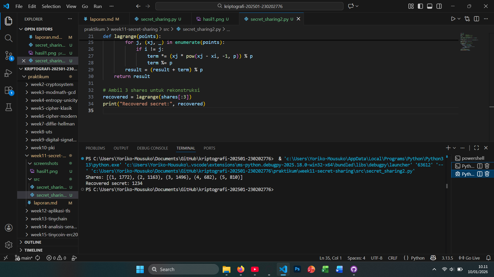

# Laporan Praktikum Kriptografi
Minggu ke-: 11  
Topik: [Secret Sharing (Shamir’s Secret Sharing)]  
Nama: [ Ramzi Selpora Widiyanto]  
NIM: [ 230202776 ]  
Kelas: [5 IKKA]  

---

## 1. Tujuan
Setelah mengikuti praktikum ini, mahasiswa diharapkan mampu:

1. Menjelaskan konsep Shamir Secret Sharing (SSS).
2. Melakukan simulasi pembagian rahasia ke beberapa pihak menggunakan skema SSS.
3. Menganalisis keamanan skema distribusi rahasia.

---

## 2. Dasar Teori
Shamir’s Secret Sharing (SSS) adalah skema kriptografi yang digunakan untuk membagi sebuah rahasia (secret) menjadi beberapa bagian (shares) sehingga rahasia tersebut tidak dapat diketahui oleh satu pihak saja. Skema ini dinyatakan sebagai skema (k, n), artinya rahasia dibagi menjadi n bagian dan hanya jika minimal k bagian digabungkan maka rahasia asli dapat direkonstruksi. Jika jumlah bagian yang dikumpulkan kurang dari k, maka tidak ada informasi berarti tentang rahasia yang dapat diperoleh.

Prinsip utama Shamir’s Secret Sharing didasarkan pada interpolasi polinomial dalam matematika. Rahasia disimpan sebagai konstanta pada sebuah polinomial berderajat (k−1), kemudian nilai polinomial tersebut dihitung pada beberapa titik untuk menghasilkan shares. Dengan minimal k titik, polinomial dapat direkonstruksi menggunakan metode seperti Lagrange Interpolation, sehingga rahasia dapat dipulihkan secara tepat.

Skema ini banyak digunakan untuk meningkatkan keamanan dan toleransi kesalahan, misalnya pada pengelolaan kunci kriptografi, sistem distributed trust, dan penyimpanan data sensitif. Dengan Shamir’s Secret Sharing, risiko kehilangan atau penyalahgunaan rahasia dapat dikurangi karena tidak ada satu pihak pun yang memegang rahasia secara utuh.

---

## 3. Alat dan Bahan
- Python 3.x  
- Visual Studio Code / editor lain  
- Git dan akun GitHub  
- Library tambahan secretsharing

---

## 4. Langkah Percobaan

1. Membuat file `secret_sharing.py` di folder `praktikum/week11-secret-sharing/src/`.
2. Menyalin kode program dari panduan praktikum.
3. Menjalankan program dengan perintah `python secret_sharing.py`.

---

## 5. Source Code


```python
from secretsharing import SecretSharer

# Rahasia yang ingin dibagi
secret = "KriptografiUPB2025"

# Bagi menjadi 5 shares, ambang batas 3 (minimal 3 shares untuk rekonstruksi)
shares = SecretSharer.split_secret(secret, 3, 5)
print("Shares:", shares)

# Rekonstruksi rahasia dari 3 shares
recovered = SecretSharer.recover_secret(shares[:3])
print("Recovered secret:", recovered)
```

---

## 6. Hasil dan Pembahasan
- Lampirkan screenshot hasil eksekusi program (taruh di folder `screenshots/`)
- Berikan tabel atau ringkasan hasil uji jika diperlukan.  
- Jelaskan apakah hasil sesuai ekspektasi.  
- Bahas error (jika ada) dan solusinya. 
"Ada error di secret_sharing.py karena library secretsharing menggunakan python versi 2, jika dipakai di python3 maka error tidak dapat terbaca ketidakcocokan versi. Lalu dibuat ke secret_sharing3.py"

Hasil eksekusi program secret sharing:





---

## 7. Jawaban Pertanyaan
1. Apa keuntungan utama Shamir Secret Sharing dibanding membagikan salinan kunci secara langsung?
Jawab :
Keuntungan utama Shamir Secret Sharing (SSS) adalah tidak adanya satu pihak pun yang memegang rahasia secara utuh. Jika kunci dibagikan sebagai salinan langsung, kebocoran satu salinan saja sudah cukup untuk membocorkan rahasia. Sebaliknya, pada SSS, setiap share tidak bermakna secara individual, sehingga meskipun sebagian share bocor, rahasia tetap aman selama jumlahnya kurang dari threshold.

2. Apa peran threshold (k) dalam keamanan secret sharing?
Jawab :
Threshold (k) menentukan jumlah minimal share yang dibutuhkan untuk merekonstruksi rahasia. Dari sisi keamanan, semakin besar nilai k, semakin sulit bagi penyerang untuk mengumpulkan cukup share guna membuka rahasia. Dari sisi keandalan, k juga mengatur toleransi kegagalan, karena rahasia tetap bisa dipulihkan meskipun beberapa share hilang selama masih memenuhi ambang batas.

3. Berikan satu contoh skenario nyata di mana SSS sangat bermanfaat.
Jawab :
Salah satu contoh nyata adalah manajemen kunci dompet cryptocurrency multi-party. Kunci privat dibagi ke beberapa pihak menggunakan Shamir Secret Sharing, dan hanya jika sejumlah pihak (misalnya 3 dari 5) bekerja sama, transaksi dapat disahkan atau kunci dapat dipulihkan. Pendekatan ini mencegah penyalahgunaan kunci oleh satu orang sekaligus mengurangi risiko kehilangan permanen.
---

## 8. Kesimpulan
Langkah 1 (Implementasi Kode):
Pada langkah ini, Shamir Secret Sharing berhasil diimplementasikan menggunakan kode Python yang kompatibel dengan Python 3, dengan rahasia berupa string “KriptografiUPB2025” yang terlebih dahulu dikonversi ke bilangan bulat. Hasil eksekusi menunjukkan bahwa rahasia dapat dibagi menjadi beberapa share dan direkonstruksi kembali secara utuh hanya dengan jumlah share yang memenuhi threshold. Hal ini membuktikan bahwa mekanisme pembagian dan pemulihan rahasia berjalan dengan benar.

Langkah 2 (Simulasi Manual):
Simulasi manual memperkuat pemahaman konsep matematis Shamir Secret Sharing, yaitu penggunaan polinomial dan interpolasi Lagrange dalam medan bilangan hingga. Tanpa bergantung pada library eksternal, langkah ini menunjukkan bahwa keamanan skema berasal dari sifat matematisnya, di mana kurang dari threshold share tidak memberikan informasi tentang rahasia. Dengan demikian, kedua langkah saling melengkapi antara implementasi praktis dan pemahaman teori dasar.
---

## 9. Daftar Pustaka

- Katz, J., & Lindell, Y. *Introduction to Modern Cryptography*.  
- Stallings, W. *Cryptography and Network Security*.
- Stinson (2019), Bab 6.

---

## 10. Commit Log

```
commit week11
Author: Ramzi Selpora Widiyanto <rasawi46rsw@gmail.com>
Date:   2025-09-20

    week11-secret-sharing: Secret Sharing (Shamir’s Secret Sharing)
```
