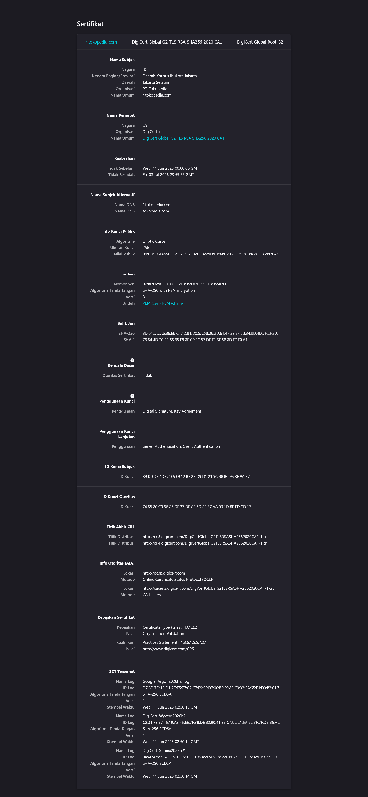
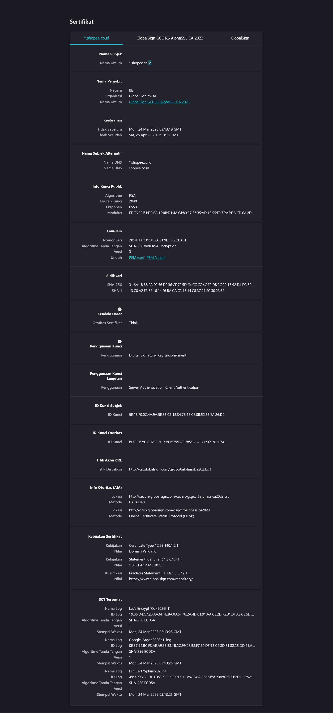

# Laporan Praktikum Kriptografi
Minggu ke-: 12  
Topik: [Aplikasi TLS & E-commerce]  
Nama: [Ramzi Selpora Widiyanto]  
NIM: [230202776]  
Kelas: [5 IKKA]  

---

## 1. Tujuan
Setelah mengikuti praktikum ini, mahasiswa diharapkan mampu:

1. Menganalisis penggunaan kriptografi pada email dan SSL/TLS.
2. Menjelaskan enkripsi dalam transaksi e-commerce.
3. Mengevaluasi isu etika & privasi dalam penggunaan kriptografi di kehidupan sehari-hari.

---

## 2. Dasar Teori
Transport Layer Security (TLS) merupakan protokol kriptografi yang digunakan untuk mengamankan komunikasi data pada jaringan komputer, khususnya di internet. TLS bekerja dengan cara mengenkripsi data yang dikirimkan antara klien (browser pengguna) dan server, sehingga informasi sensitif seperti data login, nomor kartu kredit, dan detail transaksi tidak dapat dibaca atau dimodifikasi oleh pihak yang tidak berwenang. Protokol ini juga menyediakan mekanisme autentikasi melalui sertifikat digital yang dikeluarkan oleh Certificate Authority (CA), sehingga pengguna dapat memastikan identitas server yang diakses adalah sah.

Dalam konteks e-commerce, TLS berperan penting dalam menjaga keamanan dan kepercayaan pengguna. Website e-commerce yang menggunakan TLS ditandai dengan protokol HTTPS, yang menunjukkan bahwa komunikasi telah dienkripsi dan integritas data terjamin. Dengan adanya TLS, risiko serangan seperti man-in-the-middle, pencurian data, dan pemalsuan transaksi dapat diminimalkan. Hal ini sangat krusial mengingat e-commerce melibatkan pertukaran data keuangan dan informasi pribadi pelanggan.

Penerapan TLS yang baik pada e-commerce tidak hanya meningkatkan keamanan teknis, tetapi juga berdampak pada aspek bisnis. Penggunaan TLS membantu memenuhi standar keamanan internasional, meningkatkan kepercayaan konsumen, serta mendukung kepatuhan terhadap regulasi perlindungan data. Oleh karena itu, TLS menjadi komponen fundamental dalam membangun sistem e-commerce yang aman, andal, dan profesional.
---

## 3. Alat dan Bahan
- Python 3.x  
- Visual Studio Code / editor lain  
- Git dan akun GitHub  
- Library tambahan 

---

## 4. Langkah Percobaan

Langkah 1 : Analisis SSL/TLS pada Email & Web
## Shopee Indonesia (shopee.co.id)
Issuer CA (Certificate Authority):
- GlobalSign
- Rantai sertifikat: GlobalSign GCC R6 AlphaSSL CA 2023

Masa Berlaku Sertifikat:
- Berlaku mulai: 24 Maret 2025
- Berlaku hingga: 25 April 2026

Algoritma Enkripsi yang Digunakan:
- Algoritma kunci publik: RSA
- Ukuran kunci: 2048 bit
- Algoritma tanda tangan: SHA-256 with RSA Encryption

## Tokopedia (tokopedia.com)

Issuer CA (Certificate Authority):
- DigiCert
- Rantai sertifikat: DigiCert Global G2 TLS RSA SHA256 2020 CA

Masa Berlaku Sertifikat:
- Berlaku mulai: 11 Juni 2025
- Berlaku hingga: 03 Juli 2026

Algoritma Enkripsi yang Digunakan:
- Algoritma kunci publik: Elliptic Curve Cryptography (ECC)
- Ukuran kunci: 256 bit
- Algoritma tanda tangan: SHA-256 with RSA Encryption

# Perbandingan HTTPS dan Tanpa HTTIPS
Website dengan HTTPS menggunakan protokol TLS (Transport Layer Security) untuk mengenkripsi data yang dikirim antara pengguna dan server. Dengan adanya enkripsi, informasi sensitif seperti username, password, dan data transaksi tidak dapat dibaca atau diubah oleh pihak ketiga. Selain itu, HTTPS menyediakan autentikasi server melalui sertifikat digital yang dikeluarkan oleh Certificate Authority (CA), sehingga pengguna dapat memastikan bahwa website yang diakses adalah resmi dan terpercaya. Browser modern menandai website HTTPS dengan ikon gembok yang meningkatkan rasa aman dan kepercayaan pengguna.

Sebaliknya, website tanpa HTTPS (HTTP) tidak memiliki mekanisme enkripsi maupun autentikasi. Data dikirim dalam bentuk teks biasa (plaintext), sehingga sangat mudah disadap atau dimodifikasi, terutama ketika pengguna mengaksesnya melalui jaringan publik. Website HTTP juga ditandai sebagai “Not Secure” oleh browser, yang dapat menurunkan kepercayaan pengguna dan berpotensi menyebabkan kebocoran data.

Secara keseluruhan, HTTPS memberikan perlindungan terhadap kerahasiaan dan integritas data serta menjamin identitas server, sedangkan HTTP tidak menawarkan perlindungan keamanan sama sekali. Oleh karena itu, penggunaan HTTPS menjadi standar wajib bagi website modern, khususnya website e-commerce yang menangani data pribadi dan transaksi keuangan.

Langkah 2 : Studi Kasus E-Commerce
1. Analisis penggunaan enkripsi dalam melindungi transaksi online
- Data login dan pembayaran dienkripsi menggunakan TLS sebelum dikirim dari browser ke server.
- Proses handshake TLS memanfaatkan kriptografi kunci publik untuk membangun kunci sesi yang aman.
- Setelah kunci sesi terbentuk, data dikirim menggunakan enkripsi simetris (misalnya AES) agar cepat dan aman.
- Enkripsi memastikan kerahasiaan dan integritas data sehingga tidak bisa dibaca atau diubah pihak lain.

2. Potensi ancaman jika TLS tidak digunakan
- Serangan Man-in-the-Middle memungkinkan penyerang menyadap atau memodifikasi data transaksi.
- Username, password, dan data kartu kredit dapat dicuri karena dikirim tanpa enkripsi.
- Penyerang dapat memalsukan website (phishing) karena tidak ada autentikasi server.
- Kepercayaan pengguna menurun dan risiko kerugian finansial meningkat.

Langkah 3 : Analisis Etika & Privasi

---

## 5. Source Code

```python
# contoh potongan kode
def encrypt(text, key):
    return ...
```


---

## 6. Hasil dan Pembahasan
- Lampirkan screenshot hasil eksekusi program (taruh di folder `screenshots/`).  
- Berikan tabel atau ringkasan hasil uji jika diperlukan.  
- Jelaskan apakah hasil sesuai ekspektasi.  
- Bahas error (jika ada) dan solusinya. 

Hasil Tokopedia dan Eksekusi:





---

## 7. Jawaban Pertanyaan

- Apa perbedaan utama antara HTTP dan HTTPS?
Jawab :

- Mengapa sertifikat digital menjadi penting dalam komunikasi TLS?
Jawab :

- Bagaimana kriptografi mendukung privasi dalam komunikasi digital, tetapi sekaligus menimbulkan tantangan hukum dan etika?
Jawab :


---

## 8. Kesimpulan
(Tuliskan kesimpulan singkat (2–3 kalimat) berdasarkan percobaan.  )

---

## 9. Daftar Pustaka

- Katz, J., & Lindell, Y. *Introduction to Modern Cryptography*.  
- Stallings, W. *Cryptography and Network Security*.
- Stallings (2017), Bab 15.

---

## 10. Commit Log

```
commit week12-aplikasi-tls
Author: Ramzi Selpora Widiyanto <rasawi46rsw@gmail.com>
Date:   2025-01-12

    week12-aplikasi-tls: Aplikasi TLS & E-commerce
```
