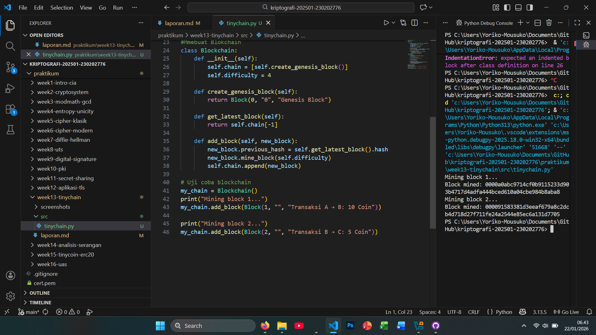

# Laporan Praktikum Kriptografi
Minggu ke-: 13
Topik: [TinyChain – Proof of Work (PoW)]  
Nama: [RAMZI SELPORA WIDIYANTO]  
NIM: [230202776]  
Kelas: [5IKKA]  

---

## 1. Tujuan
Setelah mengikuti praktikum ini, mahasiswa diharapkan mampu:
1. Menjelaskan peran hash function dalam blockchain.
2. Melakukan simulasi sederhana Proof of Work (PoW).
3. Menganalisis keamanan cryptocurrency berbasis kriptografi.

---

## 2. Dasar Teori
Proof of Work (PoW) adalah mekanisme konsensus yang digunakan untuk memvalidasi transaksi dan menambahkan blok baru ke dalam blockchain melalui proses komputasi yang memerlukan usaha atau kerja nyata. Dalam konteks TinyChain, PoW berfungsi untuk memastikan bahwa setiap blok yang ditambahkan telah melalui proses perhitungan hash dengan tingkat kesulitan tertentu sehingga tidak mudah dimanipulasi. Penambang harus menemukan nilai nonce yang menghasilkan hash sesuai kriteria yang ditentukan, sehingga jaringan dapat mencapai kesepakatan tanpa otoritas terpusat.

PoW pada TinyChain juga berperan dalam menjaga keamanan jaringan dengan membuat serangan menjadi mahal secara komputasi dan energi. Untuk mengubah satu blok, penyerang harus mengulang proses PoW pada blok tersebut dan seluruh blok setelahnya, yang secara praktis sulit dilakukan jika mayoritas kekuatan komputasi dikuasai oleh node jujur. Dengan demikian, PoW memberikan sifat imutabilitas dan keandalan data pada TinyChain meskipun dijalankan dalam skala kecil atau untuk tujuan edukasi.

Meskipun efektif dari sisi keamanan, PoW memiliki keterbatasan seperti konsumsi energi yang relatif tinggi dan kecepatan transaksi yang terbatas. Pada TinyChain, mekanisme ini biasanya disederhanakan agar mudah dipahami dan diimplementasikan tanpa kebutuhan sumber daya besar. Hal ini menjadikan TinyChain berbasis PoW cocok sebagai media pembelajaran untuk memahami prinsip dasar blockchain, konsensus terdesentralisasi, dan keamanan kriptografi.

---

## 3. Alat dan Bahan
- Python 3.x  
- Visual Studio Code / editor lain  
- Git dan akun GitHub  
- Library tambahan (misalnya pycryptodome, jika diperlukan)  

---

## 4. Langkah Percobaan
1. Membuat file `tinychain.py` di folder `praktikum/week13-tinychain/src/`.
2. Menyalin kode program dari panduan praktikum.
3. Menjalankan program dengan perintah `python tinychain.py`.

---

## 5. Source Code
# Langkah 1 dan 2

```python
#Mmebuat struktur blok
import hashlib
import time

class Block:
    def __init__(self, index, previous_hash, data, timestamp=None):
        self.index = index
        self.timestamp = timestamp or time.time()
        self.data = data
        self.previous_hash = previous_hash
        self.nonce = 0
        self.hash = self.calculate_hash()

    def calculate_hash(self):
        value = str(self.index) + str(self.timestamp) + str(self.data) + str(self.previous_hash) + str(self.nonce)
        return hashlib.sha256(value.encode()).hexdigest()

    def mine_block(self, difficulty):
        while self.hash[:difficulty] != "0" * difficulty:
            self.nonce += 1
            self.hash = self.calculate_hash()
        print(f"Block mined: {self.hash}")
#Mmebuat Blokchain
class Blockchain:
    def __init__(self):
        self.chain = [self.create_genesis_block()]
        self.difficulty = 4

    def create_genesis_block(self):
        return Block(0, "0", "Genesis Block")

    def get_latest_block(self):
        return self.chain[-1]

    def add_block(self, new_block):
        new_block.previous_hash = self.get_latest_block().hash
        new_block.mine_block(self.difficulty)
        self.chain.append(new_block)

# Uji coba blockchain
my_chain = Blockchain()
print("Mining block 1...")
my_chain.add_block(Block(1, "", "Transaksi A → B: 10 Coin"))

print("Mining block 2...")
my_chain.add_block(Block(2, "", "Transaksi B → C: 5 Coin"))
```
# Langkah 3
Proses mining dalam Proof of Work memang sengaja dirancang membutuhkan waktu dan sumber daya komputasi yang bergantung pada nilai difficulty Semakin tinggi difficulty maka semakin kecil peluang menemukan hash yang valid sehingga penambang membutuhkan lebih banyak percobaan dan waktu untuk menambang satu blok Kondisi ini membuat pembuatan blok tidak bisa dilakukan secara instan atau sembarangan.

Waktu dan usaha komputasi tersebut menjadi dasar keamanan blockchain karena setiap blok terhubung secara kriptografis dengan blok sebelumnya Jika seseorang ingin memanipulasi data pada satu blok maka ia harus menambang ulang blok tersebut dan seluruh blok setelahnya dengan difficulty yang sama atau lebih tinggi Dalam jaringan yang sehat hal ini hampir tidak mungkin dilakukan karena penyerang harus memiliki kekuatan komputasi yang melebihi mayoritas jaringan.

Dengan demikian peningkatan difficulty berfungsi sebagai penghalang ekonomis dan teknis terhadap serangan Semakin tinggi difficulty semakin mahal biaya waktu dan energi yang harus dikeluarkan untuk melakukan kecurangan Mekanisme ini memastikan bahwa cara paling rasional bagi peserta jaringan adalah mengikuti aturan konsensus sehingga integritas dan keamanan blockchain tetap terjaga.

---

## 6. Hasil dan Pembahasan
- Lampirkan screenshot hasil eksekusi program (taruh di folder `screenshots/`).  
- Berikan tabel atau ringkasan hasil uji jika diperlukan.  
- Jelaskan apakah hasil sesuai ekspektasi.  
- Bahas error (jika ada) dan solusinya. 

Hasil eksekusi program Tiny Chain:




---

## 7. Jawaban Pertanyaan
 
- Pertanyaan 1: Mengapa fungsi hash sangat penting dalam blockchain?
Jawab :
Fungsi hash berperan sebagai fondasi keamanan blockchain karena mengubah data transaksi dan informasi blok menjadi nilai hash unik dengan panjang tetap Setiap perubahan kecil pada data akan menghasilkan hash yang sangat berbeda sehingga manipulasi data dapat dengan mudah terdeteksi Hash juga digunakan untuk menghubungkan satu blok dengan blok sebelumnya melalui hash blok terdahulu sehingga membentuk rantai yang bersifat sulit diubah atau immutable Selain itu fungsi hash memungkinkan proses mining pada Proof of Work dengan menyediakan tantangan komputasi yang harus diselesaikan oleh penambang.

- Pertanyaan 2: Bagaimana Proof of Work mencegah double spending?
Jawab :
Proof of Work mencegah double spending dengan memastikan bahwa setiap transaksi divalidasi dan dicatat secara permanen dalam blockchain sebelum dianggap sah Ketika sebuah transaksi telah dimasukkan ke dalam blok dan blok tersebut berhasil ditambang maka transaksi itu tidak dapat digunakan kembali tanpa menambang ulang blok tersebut dan blok setelahnya Karena proses mining membutuhkan waktu dan biaya besar jaringan akan selalu menerima rantai terpanjang atau dengan kerja terbesar sebagai yang valid sehingga upaya menggunakan koin yang sama lebih dari sekali menjadi sangat sulit dilakukan.

- Pertanyaan 3: Apa kelemahan dari PoW dalam hal efisiensi energi?
Jawab:
Kelemahan utama PoW adalah konsumsi energi yang tinggi karena penambang harus melakukan perhitungan hash berulang kali untuk menemukan solusi yang valid Sebagian besar energi tersebut tidak menghasilkan nilai langsung selain menjaga keamanan jaringan Hal ini menimbulkan dampak lingkungan biaya operasional yang besar serta keterbatasan skalabilitas sehingga PoW sering dikritik dan mendorong pengembangan mekanisme konsensus alternatif yang lebih hemat energi.

---

## 8. Kesimpulan
Berdasarkan implementasi kode blockchain sederhana di atas dapat disimpulkan bahwa fungsi hash dan mekanisme Proof of Work berperan penting dalam menjaga integritas dan keamanan blockchain Setiap blok memiliki hash unik yang dihasilkan dari kombinasi data blok hash blok sebelumnya timestamp dan nonce sehingga perubahan sekecil apa pun pada data akan mengubah hash secara signifikan dan mudah terdeteksi.

Proses mining dengan tingkat difficulty tertentu memaksa penambang untuk melakukan perhitungan berulang hingga menemukan hash yang valid Semakin tinggi difficulty semakin lama waktu yang dibutuhkan untuk menambang blok Hal ini menciptakan hambatan komputasi yang membuat manipulasi data dan pembuatan blok palsu menjadi sangat sulit karena penyerang harus menambang ulang seluruh blok setelahnya.

Dengan menghubungkan setiap blok melalui previous_hash blockchain membentuk rantai data yang bersifat sulit diubah Proof of Work memastikan bahwa hanya blok yang telah melalui usaha komputasi yang sah yang dapat ditambahkan ke dalam rantai Sehingga sistem blockchain meskipun sederhana seperti pada TinyChain tetap mampu menunjukkan prinsip dasar keamanan desentralisasi dan pencegahan kecurangan dalam transaksi digital.
---

## 9. Daftar Pustaka  
- Katz, J., & Lindell, Y. *Introduction to Modern Cryptography*.  
- Stallings, W. *Cryptography and Network Security*.
- Stallings (2017), Bab 16.
- Stinson (2019), Bab 8.


---

## 10. Commit Log

```
commit week13
Author: Ramzi Selpora Widiyanto <rasawi46rsw@gmail.com>
Date:   2026-01-22

    week13-tinychain: Tiny Chain – Proof of Work (PoW)
```
