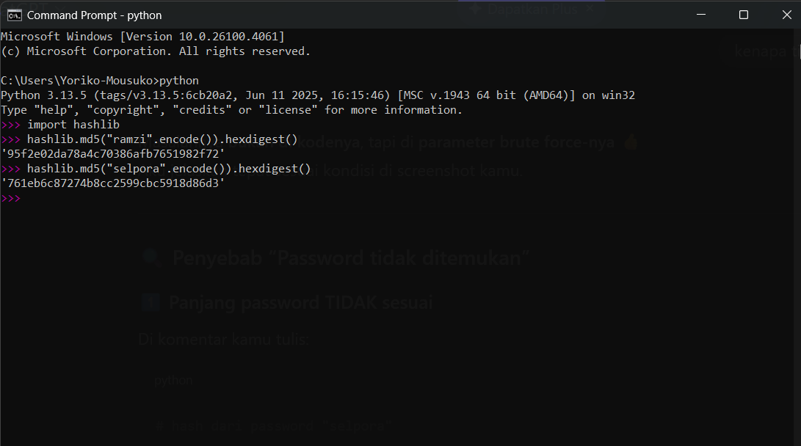

# Laporan Praktikum Kriptografi
Minggu ke-: 14
Topik: [Analisis Serangan Kriptografi]  
Nama: [Ramzi Selpora Widiyanto]  
NIM: [230202776]  
Kelas: [5IKKA]  

---

## 1. Tujuan
Setelah mengikuti praktikum ini, mahasiswa diharapkan mampu:
1. Mengidentifikasi jenis serangan pada sistem informasi nyata.
2. Mengevaluasi kelemahan algoritma kriptografi yang digunakan.
3. Memberikan rekomendasi algoritma kriptografi yang sesuai untuk perbaikan keamanan.

---

## 2. Dasar Teori
(Ringkas teori relevan (cukup 2–3 paragraf).  
Contoh: definisi cipher klasik, konsep modular aritmetika, dll.  )

---

## 3. Alat dan Bahan
(- Python 3.x  
- Visual Studio Code / editor lain  
- Git dan akun GitHub  
- Library tambahan (misalnya pycryptodome, jika diperlukan)  )

---

## 4. Langkah Percobaan
(Tuliskan langkah yang dilakukan sesuai instruksi.  
Contoh format:
1. Membuat file `caesar_cipher.py` di folder `praktikum/week2-cryptosystem/src/`.
2. Menyalin kode program dari panduan praktikum.
3. Menjalankan program dengan perintah `python caesar_cipher.py`.)

---

## 5. Source Code
# BRUTE FORCE SEDERHANA MD5
```python
import hashlib
import itertools
import string

# Hash MD5 target (contoh: hash dari password "selpora")
target_hash = "761eb6c87274b8cc2599cbc5918d86d3"

# Karakter yang akan dicoba
characters = string.ascii_lowercase  # a-z
max_length = 7  # panjang password maksimal

def md5_hash(text):
    return hashlib.md5(text.encode()).hexdigest()

found = False

for length in range(1, max_length + 1):
    for guess in itertools.product(characters, repeat=length):
        password = ''.join(guess)
        if md5_hash(password) == target_hash:
            print("Password ditemukan:", password)
            found = True
            break
    if found:
        break

if not found:
    print("Password tidak ditemukan")

```


---

## 6. Hasil dan Pembahasan
- Lampirkan screenshot hasil eksekusi program (taruh di folder `screenshots/`).  
- Berikan tabel atau ringkasan hasil uji jika diperlukan.  
- Jelaskan apakah hasil sesuai ekspektasi.  
- Bahas error (jika ada) dan solusinya. 

Hasil eksekusi program bruteforce md5:



Eksekusi sangat lama karena panjang huruf ada 7, jika menggunakan panjang huruf seperti 3 atau 4 mungkin waktu eksekusi tidak akan lama
---

## 7. Jawaban Pertanyaan

- Pertanyaan 1: Mengapa banyak sistem lama masih rentan terhadap brute force atau dictionary attack?
Jawab :
Banyak sistem lama dirancang pada masa ketika kemampuan komputasi masih terbatas sehingga algoritma dan mekanisme keamanannya belum mempertimbangkan ancaman brute force modern Sistem tersebut sering menggunakan algoritma hash cepat seperti MD5 atau SHA-1 tanpa salt serta tidak menerapkan pembatasan percobaan login Akibatnya ketika database bocor penyerang dapat dengan mudah melakukan brute force atau dictionary attack menggunakan perangkat keras modern seperti GPU dan cloud computing Selain itu faktor biaya migrasi dan ketergantungan pada sistem lama membuat banyak organisasi menunda pembaruan keamanan.

- Pertanyaan 2: Apa bedanya kelemahan algoritma dengan kelemahan implementasi?
Jawab :
Kelemahan algoritma berasal dari desain kriptografi itu sendiri misalnya MD5 yang secara matematis rentan terhadap collision dan brute force sehingga tidak aman meskipun diimplementasikan dengan benar Sementara itu kelemahan implementasi terjadi ketika algoritma yang sebenarnya kuat digunakan dengan cara yang salah seperti tidak menambahkan salt menyimpan password dalam bentuk plaintext menggunakan parameter keamanan yang terlalu rendah atau salah konfigurasi sistem Dengan kata lain algoritma lemah tidak bisa diperbaiki dengan implementasi sedangkan algoritma kuat bisa menjadi lemah jika diimplementasikan secara keliru.

- Pertanyaan 3: Bagaimana organisasi dapat memastikan sistem kriptografi mereka tetap aman di masa depan?
Jawab :
Organisasi dapat menjaga keamanan sistem kriptografi dengan secara rutin memperbarui algoritma dan standar keamanan mengikuti rekomendasi komunitas kriptografi dan lembaga resmi seperti NIST Penggunaan algoritma modern seperti AES SHA-256 TLS terbaru serta password hashing yang kuat seperti bcrypt atau Argon2 harus disertai audit keamanan berkala pengujian penetrasi dan manajemen kunci yang baik Selain itu desain sistem harus bersifat fleksibel agar mudah bermigrasi ke algoritma baru ketika algoritma lama dinyatakan tidak aman sehingga keamanan jangka panjang dapat terjaga.

---

## 8. Kesimpulan
Berdasarkan percobaan brute force terhadap hash MD5 dari password “selpora”, dapat disimpulkan bahwa meskipun algoritma MD5 secara kriptografis sudah lemah, proses brute force tetap membutuhkan waktu yang sangat lama ketika password memiliki panjang yang cukup dan ruang karakter yang besar Dengan kombinasi karakter huruf a–z dan panjang 7 karakter, jumlah kemungkinan mencapai miliaran kombinasi sehingga tidak dapat diselesaikan dalam waktu singkat pada komputer biasa.

Hasil ini menunjukkan bahwa panjang dan kompleksitas password berpengaruh besar terhadap ketahanan terhadap brute force attack, bahkan pada algoritma hash yang sudah tidak direkomendasikan seperti MD5 Namun ketahanan ini bersifat semu karena dengan perangkat keras yang lebih kuat atau optimasi tertentu MD5 tetap dapat dipecahkan Oleh karena itu MD5 tetap tidak layak digunakan untuk penyimpanan password.

Percobaan ini menegaskan pentingnya penggunaan algoritma hashing yang tepat dan mekanisme keamanan tambahan seperti salt dan fungsi hash yang dirancang khusus untuk password seperti bcrypt atau Argon2 Dengan kombinasi password yang kuat dan algoritma modern, sistem akan jauh lebih tahan terhadap brute force dan dictionary attack di lingkungan nyata.
---

## 9. Daftar Pustaka
- Katz, J., & Lindell, Y. *Introduction to Modern Cryptography*.  
- Stallings, W. *Cryptography and Network Security*.
- Stallings (2017), Bab 16.

---

## 10. Commit Log

```
commit week14
Author: Ramzi Selpora Widiyanto <rasawi46rsw@gmail.com>
Date:   2026-01-22

    week14-analisis-serangan: Analisis Serangan Kriptografi
```
