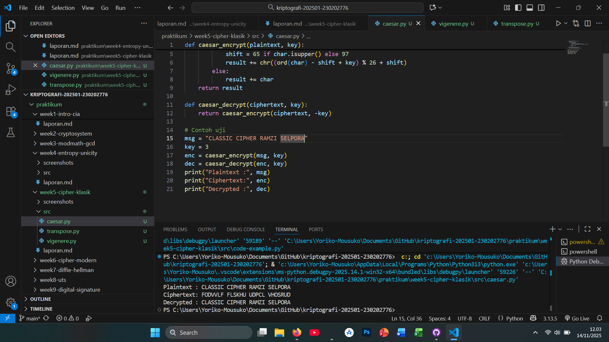
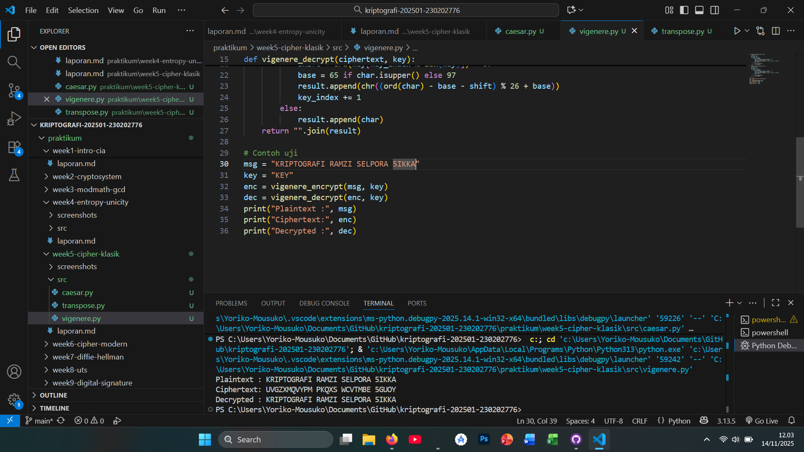
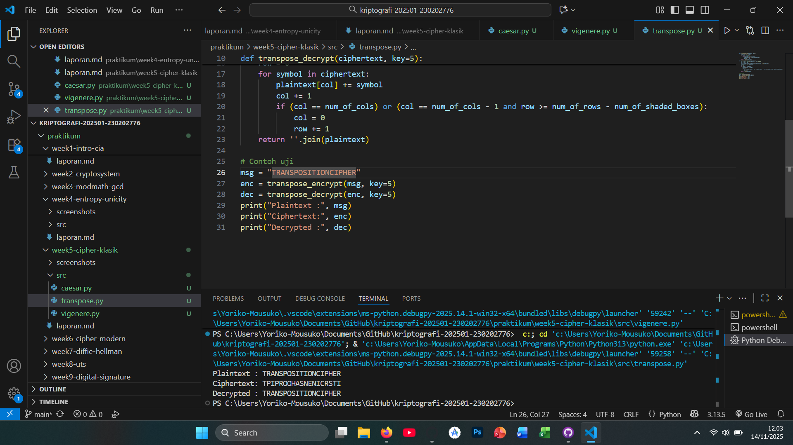

# Laporan Praktikum Kriptografi
Minggu ke-: 5  
Topik: [Cipher Klasik (Caesar, Vigenère, Transposisi)]  
Nama: [Ramzi Selpora Widiyanto]  
NIM: [230202776]  
Kelas: [5 IKKA]  

---

## 1. Tujuan
1. Menerapkan algoritma Caesar Cipher untuk enkripsi dan dekripsi teks.
2. Menerapkan algoritma Vigenère Cipher dengan variasi kunci.
3. Mengimplementasikan algoritma transposisi sederhana.
4. Menjelaskan kelemahan algoritma kriptografi klasik.

---

## 2. Dasar Teori
Cipher klasik adalah metode enkripsi yang digunakan sebelum munculnya kriptografi modern, dengan prinsip dasar mengubah posisi atau bentuk huruf dalam pesan agar sulit dibaca tanpa kunci. Salah satu yang paling sederhana adalah Caesar Cipher, yang bekerja dengan mengganti setiap huruf pada teks asli dengan huruf lain yang berjarak tetap dalam alfabet. Misalnya, pergeseran 3 akan mengubah “A” menjadi “D”. Meskipun mudah dipahami, cipher ini sangat lemah karena hanya memiliki 26 kemungkinan kunci, sehingga mudah dipecahkan dengan brute force atau analisis frekuensi.

Vigenère Cipher memperkuat Caesar Cipher dengan menggunakan kunci berupa kata atau frasa untuk menentukan jumlah pergeseran setiap huruf secara bergantian. Karena pola pergeserannya berubah-ubah, cipher ini sempat dianggap sulit dipecahkan. Namun, dengan teknik seperti analisis Kasiski dan Friedman test, pola kunci dapat diungkap jika teks cukup panjang.

Berbeda dengan keduanya, Transposition Cipher tidak mengubah huruf itu sendiri, tetapi menukar urutan huruf dalam pesan berdasarkan aturan tertentu (misalnya kolom atau baris). Keamanannya bergantung pada kerumitan pola penukaran tersebut. Secara umum, cipher klasik mudah dipelajari namun memiliki tingkat keamanan rendah karena pola dan struktur bahasa masih bisa dianalisis untuk menemukan kunci atau pesan aslinya.
---

## 3. Alat dan Bahan
(- Python 3.x  
- Visual Studio Code / editor lain  
- Git dan akun GitHub  
- Library tambahan (misalnya pycryptodome, jika diperlukan)  )

---

## 4. Langkah Percobaan
1. Membuat file `caesar.py` `vigenere.py` `transpose.py` di folder `praktikum/week2-cryptosystem/src/`.
2. Menyalin kode program dari panduan praktikum.
3. Menjalankan program dengan perintah `caesar.py` `vigenere.py` `transpose.py`

---

## 5. Source Code

### 1 — Implementasi Caesar Cipher
```python
def caesar_encrypt(plaintext, key):
    result = ""
    for char in plaintext:
        if char.isalpha():
            shift = 65 if char.isupper() else 97
            result += chr((ord(char) - shift + key) % 26 + shift)
        else:
            result += char
    return result

def caesar_decrypt(ciphertext, key):
    return caesar_encrypt(ciphertext, -key)

# Contoh uji
msg = "CLASSIC CIPHER"
key = 3
enc = caesar_encrypt(msg, key)
dec = caesar_decrypt(enc, key)
print("Plaintext :", msg)
print("Ciphertext:", enc)
print("Decrypted :", dec)
```

---

### 2 — Implementasi Vigenère Cipher
```python
def vigenere_encrypt(plaintext, key):
    result = []
    key = key.lower()
    key_index = 0
    for char in plaintext:
        if char.isalpha():
            shift = ord(key[key_index % len(key)]) - 97
            base = 65 if char.isupper() else 97
            result.append(chr((ord(char) - base + shift) % 26 + base))
            key_index += 1
        else:
            result.append(char)
    return "".join(result)

def vigenere_decrypt(ciphertext, key):
    result = []
    key = key.lower()
    key_index = 0
    for char in ciphertext:
        if char.isalpha():
            shift = ord(key[key_index % len(key)]) - 97
            base = 65 if char.isupper() else 97
            result.append(chr((ord(char) - base - shift) % 26 + base))
            key_index += 1
        else:
            result.append(char)
    return "".join(result)

# Contoh uji
msg = "KRIPTOGRAFI"
key = "KEY"
enc = vigenere_encrypt(msg, key)
dec = vigenere_decrypt(enc, key)
print("Plaintext :", msg)
print("Ciphertext:", enc)
print("Decrypted :", dec)
```

---

### 3 — Implementasi Transposisi Sederhana
```python
def transpose_encrypt(plaintext, key=5):
    ciphertext = [''] * key
    for col in range(key):
        pointer = col
        while pointer < len(plaintext):
            ciphertext[col] += plaintext[pointer]
            pointer += key
    return ''.join(ciphertext)

def transpose_decrypt(ciphertext, key=5):
    num_of_cols = int(len(ciphertext) / key + 0.9999)
    num_of_rows = key
    num_of_shaded_boxes = (num_of_cols * num_of_rows) - len(ciphertext)
    plaintext = [''] * num_of_cols
    col = 0
    row = 0
    for symbol in ciphertext:
        plaintext[col] += symbol
        col += 1
        if (col == num_of_cols) or (col == num_of_cols - 1 and row >= num_of_rows - num_of_shaded_boxes):
            col = 0
            row += 1
    return ''.join(plaintext)

# Contoh uji
msg = "TRANSPOSITIONCIPHER"
enc = transpose_encrypt(msg, key=5)
dec = transpose_decrypt(enc, key=5)
print("Plaintext :", msg)
print("Ciphertext:", enc)
print("Decrypted :", dec)
```

---

## 6. Hasil dan Pembahasan
Hasil eksekusi program Cipher Klasik:





---

## 7. Jawaban Pertanyaan
 
- Pertanyaan 1: 
# Caesar Cipher

Kuncinya sangat kecil (hanya 25 kemungkinan pergeseran), sehingga sangat mudah di-bruteforce.

Pola huruf tetap: karakter yang sering muncul dalam plaintext akan tetap sering muncul di ciphertext → mudah dibongkar lewat analisis frekuensi.

# Vigenère Cipher

Jika panjang kunci pendek, pola pengulangan dapat dianalisis menggunakan metode Kasiski atau Friedman test untuk menebak panjang kunci.

Setelah panjang kunci diketahui, cipher berubah menjadi serangkaian Caesar Cipher → bisa dipecahkan dengan analisis frekuensi per kolom.

Vigenère tampak lebih kuat, tapi tetap rentan pada serangan statistik.

- Pertanyaan 2:

Cipher klasik (seperti Caesar, Vigenère, atau substitusi sederhana) tidak menghilangkan pola statistik bahasa. Frekuensi huruf seperti “A”, “E”, “N”, atau pola pasangan huruf tetap muncul dalam ciphertext. Karena pola ini tidak tersembunyi:

Penyerang dapat mencocokkan distribusi frekuensi ciphertext dengan distribusi huruf bahasa target.

Pola seperti huruf yang sering, bigram (dua huruf), dan trigram (tiga huruf) membantu menebak huruf-huruf lain.

Akibatnya, cipher klasik mudah dibongkar meski tanpa mengetahui kunci.

- Pertanyaan 3:

Substitusi mengubah huruf tetapi mempertahankan pola frekuensi → mudah dipetakan.

Transposisi mengacak posisi huruf tetapi tidak mengubah huruf → tetap menyisakan pola posisi yang dapat dianalisis.

---

## 8. Kesimpulan
Cipher klasik seperti Caesar Cipher, Vigenère Cipher, dan cipher transposisi merupakan teknik enkripsi awal yang bekerja melalui operasi sederhana seperti pergeseran huruf, substitusi, atau pengacakan posisi karakter. Meskipun mudah dipahami dan diterapkan, cipher klasik memiliki struktur yang terlalu sederhana dan pola yang dihasilkan masih dapat dikenali.

Kelemahan utama cipher klasik adalah rentan terhadap analisis frekuensi, karena karakter dalam ciphertext tetap mempertahankan pola kemunculan huruf dari bahasa aslinya. Dengan menganalisis frekuensi huruf, seorang penyerang dapat menebak kunci maupun isi pesan dengan relatif cepat. Selain itu, sebagian besar cipher klasik memiliki ruang kunci yang sangat kecil, sehingga mudah dipecahkan melalui brute force.

Secara keseluruhan, cipher klasik memiliki nilai historis dan edukatif, tetapi tidak lagi aman untuk digunakan pada komunikasi modern. Algoritma kriptografi masa kini sudah beralih ke cipher modern yang jauh lebih kuat, seperti AES dan RSA, yang menawarkan keamanan berbasis matematika kompleks dan ukuran kunci yang besar.
---

## 9. Daftar Pustaka
  
- Katz, J., & Lindell, Y. *Introduction to Modern Cryptography*.  
- Stallings, W. *Cryptography and Network Security*.  

---

## 10. Commit Log

```
commit week5-cipher-klasik
Author: Ramzi Selpora Widiyanto <rasawi46rsw@gmail.com>
Date:   2025-11-14

    week5-cipher-klasik : Cipher Klasik (Caesar, Vigenère, Transposisi)
```
