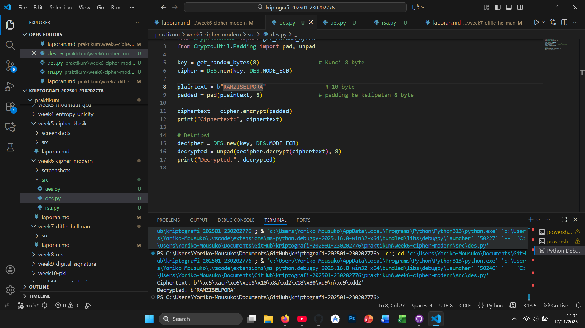
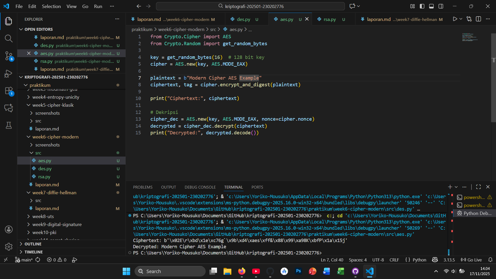
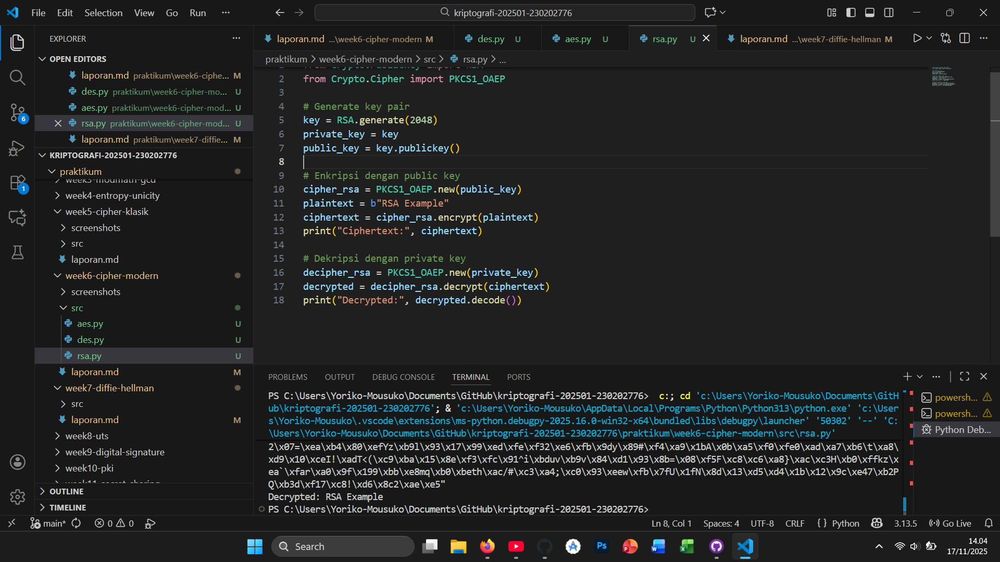

# Laporan Praktikum Kriptografi
Minggu ke-: 6  
Topik: [Cipher Modern (DES, AES, RSA)]  
Nama: [Ramzi Selpora Widiyanto]  
NIM: [230202776]  
Kelas: [5 IKKA]  

---

## 1. Tujuan
Tujuan Pembelajaran

Setelah mengikuti praktikum ini, mahasiswa diharapkan mampu:
1. Mengimplementasikan algoritma DES untuk blok data sederhana.
2. Menerapkan algoritma AES dengan panjang kunci 128 bit.
3. Menjelaskan proses pembangkitan kunci publik dan privat pada algoritma RSA.

---

## 2. Dasar Teori
Cipher modern dirancang untuk mengatasi kelemahan cipher klasik dengan menerapkan prinsip matematika yang jauh lebih kuat serta memanfaatkan operasi biner tingkat rendah. Salah satu cipher modern simetris awal adalah DES (Data Encryption Standard), yang bekerja dengan blok 64-bit dan kunci 56-bit. DES menggunakan struktur Feistel network dengan 16 ronde transformasi yang mencakup substitusi, permutasi, dan operasi XOR. Namun, ukuran kunci DES yang kecil membuatnya rentan terhadap brute force, sehingga kini tidak dianggap aman lagi.

Untuk menggantikan DES, dikembangkan AES (Advanced Encryption Standard) yang juga merupakan cipher blok simetris, tetapi menggunakan ukuran blok 128-bit dan kunci 128/192/256-bit. AES memakai struktur Substitution–Permutation Network (SPN) dengan ronde yang melibatkan operasi seperti SubBytes, ShiftRows, MixColumns, dan AddRoundKey. Desainnya efisien untuk perangkat keras maupun perangkat lunak, serta tahan terhadap serangan kriptografi modern, sehingga menjadi standar enkripsi global untuk keamanan data.

Berbeda dari DES dan AES yang simetris, RSA merupakan cipher asimetris—menggunakan pasangan kunci publik dan privat. RSA didasarkan pada kesulitan faktorisasi bilangan besar, di mana keamanan enkripsi bergantung pada ukuran modulus (biasanya 2048–4096 bit). RSA banyak digunakan untuk pertukaran kunci, tanda tangan digital, dan komunikasi aman pada protokol seperti TLS. Karena prosesnya lebih berat dibanding AES, RSA biasanya tidak dipakai untuk mengenkripsi data dalam jumlah besar, tetapi hanya untuk negosiasi kunci.
---

## 3. Alat dan Bahan
(- Python 3.x  
- Visual Studio Code / editor lain  
- Git dan akun GitHub  
- Library tambahan (misalnya pycryptodome, jika diperlukan)  )

---

## 4. Langkah Percobaan

1. Membuat file `caesar_cipher.py` di folder `praktikum/week2-cryptosystem/src/`.
2. Menyalin kode program dari panduan praktikum.
3. Menjalankan program dengan perintah `python caesar_cipher.py`.

---

## 5. Source Code
(Salin kode program utama yang dibuat atau dimodifikasi.  
Gunakan blok kode:

```python
# contoh potongan kode
def encrypt(text, key):
    return ...
```
)

---

## 6. Hasil dan Pembahasan
  
Hasil eksekusi program Caesar Cipher:






---

## 7. Jawaban Pertanyaan

- Pertanyaan 1:
Perbedaan mendasar antara DES, AES, dan RSA dalam hal kunci dan keamanan
# DES (Data Encryption Standard) – Simetris

Jenis kunci: Simetris (satu kunci sama untuk enkripsi & dekripsi).
Ukuran kunci: 56 bit.
Keamanan: Saat ini tidak aman karena kunci terlalu pendek dan mudah dibobol dengan brute force.
Kecepatan: Cepat tetapi sudah tidak relevan untuk sistem modern.

# AES (Advanced Encryption Standard) – Simetris

Jenis kunci: Simetris.
Ukuran kunci: 128, 192, atau 256 bit.
Keamanan: Sangat kuat, tahan brute force dan serangan kripto modern.
Kecepatan: Sangat cepat dan efisien pada hardware maupun software.

# RSA – Asimetris

Jenis kunci: Asimetris (kunci publik untuk enkripsi, kunci privat untuk dekripsi).
Ukuran kunci: 1024–4096 bit (standar modern: 2048 bit ke atas).
Keamanan: Berdasarkan kesulitan memfaktorkan bilangan prima besar; sangat aman jika ukuran kunci cukup besar.
Kecepatan: Jauh lebih lambat dibanding AES. 

- Pertanyaan 2:
Keamanan DES terlalu lemah → kunci 56 bit bisa dibobol kurang dari sehari menggunakan perangkat modern.
AES memiliki kunci jauh lebih besar (hingga 256 bit), sehingga tahan brute force.
AES lebih efisien pada CPU modern, bahkan banyak prosesor memiliki instruksi khusus (AES-NI) agar enkripsi makin cepat.
AES mendukung data modern yang besar dan menjadi standar global untuk VPN, disk encryption, TLS, dan sistem keamanan lainnya.

- Pertanyaan 3:
Karena RSA menggunakan dua kunci berbeda:
-Kunci publik: digunakan untuk enkripsi atau verifikasi tanda tangan.
-Kunci privat: digunakan untuk dekripsi atau pembuatan tanda tangan.
-Kedua kunci ini berbeda tetapi secara matematis saling terkait.

# Proses pembangkitan kunci RSA :
1. Pilih dua bilangan prima besar
p dan q.

2. Hitung modulus
n=p×q — digunakan sebagai bagian kunci publik & privat.

3. Hitung totien Euler
ϕ(n)=(p−1)(q−1).

4. Pilih bilangan e
-biasanya 65537
-harus relatif prima dengan 
ϕ(n).
Ini menjadi kunci publik exponent.

5. Hitung d
-sebagai invers modular:
d≡e−1mod  ϕ(n)
-Ini menjadi kunci privat exponent.

6. Hasil:
-Kunci publik: (e, n)
-Kunci privat: (d, n)
---

## 8. Kesimpulan
Secara mendasar, DES, AES, dan RSA berbeda dalam jenis kunci, ukuran kunci, dan tingkat keamanan. DES dan AES merupakan algoritma simetris, menggunakan satu kunci yang sama untuk enkripsi dan dekripsi, sedangkan RSA adalah asimetris, yang menggunakan pasangan kunci publik dan privat. DES tidak lagi aman karena ukuran kuncinya hanya 56 bit, sementara AES jauh lebih kuat dengan panjang kunci hingga 256 bit dan dirancang tahan terhadap serangan modern. RSA memiliki ukuran kunci jauh lebih besar (umumnya 2048 bit ke atas) dan keamanannya bergantung pada sulitnya memfaktorkan bilangan prima besar.

AES lebih banyak digunakan saat ini karena lebih aman, lebih cepat, dan lebih efisien dibanding DES. AES juga memiliki dukungan hardware di prosesor modern, menjadikannya standar global untuk enkripsi data. DES sudah resmi dianggap usang dan tidak direkomendasikan karena rentan terhadap brute force.

RSA dikategorikan sebagai algoritma asimetris karena menggunakan dua kunci berbeda yang saling berpasangan, masing-masing untuk enkripsi dan dekripsi. Proses pembangkitan kunci RSA melibatkan pemilihan dua bilangan prima besar, perhitungan modulus dan totient, serta menentukan eksponen publik dan privat melalui operasi matematika berbasis inverse modulo. Sistem ini memungkinkan komunikasi aman tanpa harus membagikan kunci rahasia secara langsung.
---

## 9. Daftar Pustaka

- Katz, J., & Lindell, Y. *Introduction to Modern Cryptography*.  
- Stallings, W. *Cryptography and Network Security*. 

---

## 10. Commit Log

```
commit week6-cipher-modern
Author: Nama Mahasiswa <email>
Date:   2025-09-20

    week6-cipher-modern : Cipher Modern (DES, AES, RSA)
```
