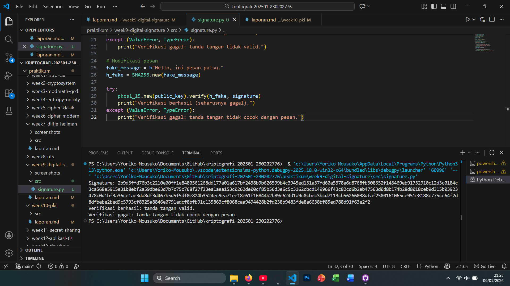

# Laporan Praktikum Kriptografi
Minggu ke-: 9  
Topik: [Digital Signature (RSA/DSA)]  
Nama: [Ramzi Selpora Widiyanto]  
NIM: [230202776]  
Kelas: [5 IKKA]  

---

## 1. Tujuan
Setelah mengikuti praktikum ini, mahasiswa diharapkan mampu:
1. Mengimplementasikan tanda tangan digital menggunakan algoritma RSA/DSA.
2. Memverifikasi keaslian tanda tangan digital.
3. Menjelaskan manfaat tanda tangan digital dalam otentikasi pesan dan integritas data
---

## 2. Dasar Teori
Digital Signature (RSA/DSA) adalah mekanisme kriptografi kunci publik yang digunakan untuk menjamin keaslian (authentication), keutuhan data (integrity), dan anti-penyangkalan (non-repudiation) pada pesan atau dokumen digital. Prosesnya melibatkan dua kunci: kunci privat untuk menandatangani pesan dan kunci publik untuk memverifikasi tanda tangan. Umumnya, pesan tidak ditandatangani secara langsung, melainkan terlebih dahulu di-hash (misalnya dengan SHA-256), lalu nilai hash tersebut yang ditandatangani.

Pada RSA Digital Signature, penandatanganan dilakukan dengan mengenkripsi nilai hash menggunakan kunci privat RSA, sedangkan verifikasi dilakukan dengan kunci publik RSA untuk membandingkan hasil dekripsi dengan hash pesan yang dihitung ulang. RSA relatif sederhana dan banyak digunakan, tetapi ukuran kunci yang besar dibutuhkan untuk tingkat keamanan tinggi, sehingga kurang efisien untuk perangkat dengan sumber daya terbatas.

Sementara itu, DSA (Digital Signature Algorithm) dirancang khusus untuk tanda tangan digital dan berbasis pada kesulitan masalah logaritma diskret. DSA menghasilkan tanda tangan berupa sepasang nilai (r, s) dan umumnya lebih efisien dibanding RSA dalam hal ukuran tanda tangan dan komputasi. Namun, keamanan DSA sangat bergantung pada penggunaan bilangan acak (nonce) yang benar; kesalahan pada nonce dapat menyebabkan kebocoran kunci privat.
---

## 3. Alat dan Bahan
- Python 3.x  
- Visual Studio Code / editor lain  
- Git dan akun GitHub  
- Library tambahan pycryptodome

---

## 4. Langkah Percobaan
1. Membuat file `signature.py` di folder `praktikum/week9-digital-signature/src/`.
2. Menyalin kode program dari panduan praktikum.
3. Menjalankan program dengan perintah `python signature.py`.

---

## 5. Source Code

```python
from Crypto.PublicKey import RSA
from Crypto.Signature import pkcs1_15
from Crypto.Hash import SHA256

# Generate pasangan kunci RSA
key = RSA.generate(2048)
private_key = key
public_key = key.publickey()

# Pesan yang akan ditandatangani
message = b"Hello, ini pesan penting."
h = SHA256.new(message)

# Buat tanda tangan dengan private key
signature = pkcs1_15.new(private_key).sign(h)
print("Signature:", signature.hex())

try:
    pkcs1_15.new(public_key).verify(h, signature)
    print("Verifikasi berhasil: tanda tangan valid.")
except (ValueError, TypeError):
    print("Verifikasi gagal: tanda tangan tidak valid.")

# Modifikasi pesan
fake_message = b"Hello, ini pesan palsu."
h_fake = SHA256.new(fake_message)

try:
    pkcs1_15.new(public_key).verify(h_fake, signature)
    print("Verifikasi berhasil (seharusnya gagal).")
except (ValueError, TypeError):
    print("Verifikasi gagal: tanda tangan tidak cocok dengan pesan.")
```


---

## 6. Hasil dan Pembahasan
- Lampirkan screenshot hasil eksekusi program (taruh di folder `screenshots/`).  
- Berikan tabel atau ringkasan hasil uji jika diperlukan.  
- Jelaskan apakah hasil sesuai ekspektasi.  
- Bahas error (jika ada) dan solusinya. 

Hasil eksekusi program Signature:



---

## 7. Jawaban Pertanyaan
1. Apa perbedaan utama antara enkripsi RSA dan tanda tangan digital RSA?
Jawab:
Enkripsi RSA bertujuan untuk menjaga kerahasiaan (confidentiality) pesan, di mana pesan dienkripsi menggunakan kunci publik penerima dan hanya dapat dibuka dengan kunci privat penerima. Sebaliknya, tanda tangan digital RSA bertujuan untuk menjamin keaslian dan keutuhan pesan, di mana pesan (atau hash-nya) ditandatangani menggunakan kunci privat pengirim dan diverifikasi menggunakan kunci publik pengirim.

2. Mengapa tanda tangan digital menjamin integritas dan otentikasi pesan?
Jawab:
Tanda tangan digital menjamin integritas karena tanda tangan dibuat dari nilai hash pesan; jika pesan diubah, nilai hash akan berubah dan verifikasi tanda tangan gagal. Tanda tangan digital juga menjamin otentikasi karena hanya pemilik kunci privat yang sah yang dapat membuat tanda tangan tersebut, sehingga penerima dapat memastikan identitas pengirim.

3. Bagaimana peran Certificate Authority (CA) dalam sistem tanda tangan digital modern?
Jawab:
Certificate Authority (CA) berperan sebagai pihak tepercaya yang memverifikasi identitas pemilik kunci publik dan menerbitkan sertifikat digital. Sertifikat ini mengaitkan identitas (individu, organisasi, atau server) dengan kunci publik tertentu, sehingga pengguna dapat mempercayai bahwa kunci publik yang digunakan untuk verifikasi tanda tangan benar-benar milik pihak yang sah dan bukan hasil pemalsuan.

---

## 8. Kesimpulan
Kode tersebut menunjukkan cara kerja digital signature RSA dalam menjamin keaslian dan keutuhan pesan. Pesan di-hash menggunakan SHA-256, lalu ditandatangani dengan private key sehingga menghasilkan signature unik. Signature ini hanya bisa diverifikasi menggunakan public key yang sesuai, membuktikan bahwa pesan benar-benar berasal dari pemilik private key.

Hasil verifikasi berhasil ketika pesan tidak diubah, namun gagal saat pesan dimodifikasi. Ini membuktikan bahwa perubahan sekecil apa pun pada pesan akan membuat tanda tangan tidak valid, sehingga digital signature efektif untuk mendeteksi pemalsuan dan manipulasi data.

Dengan demikian, digital signature RSA memberikan authentication, integrity, dan non-repudiation, sehingga sangat penting dalam sistem keamanan seperti transaksi digital, sertifikat SSL, dan dokumen elektronik resmi.
---

## 9. Daftar Pustaka

- Katz, J., & Lindell, Y. *Introduction to Modern Cryptography*.  
- Stallings, W. *Cryptography and Network Security*. 

---

## 10. Commit Log

```
commit week9
Author: Ramzi Selpora Widiyanto <rasawi46rsw@gmail.com>
Date:   2026-01-09

    week9-digital-signature: Digital Signature (RSA/DSA)
```
